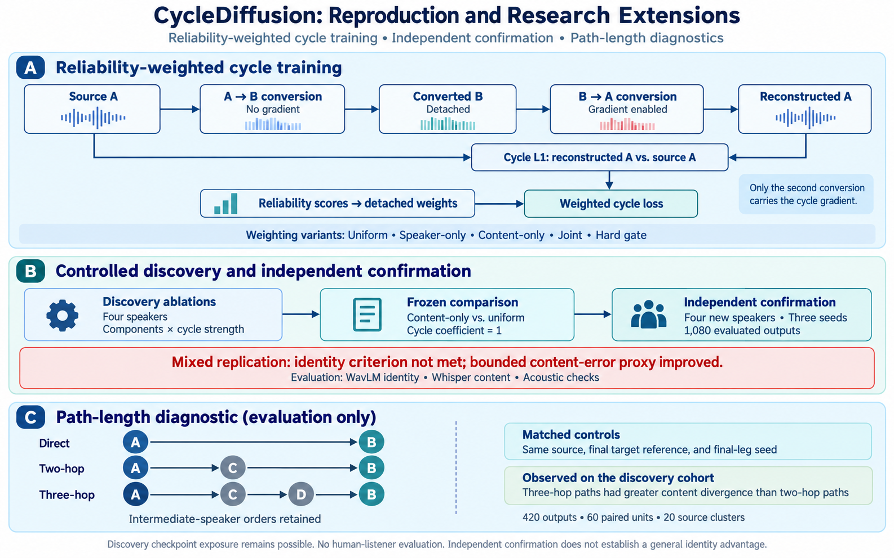
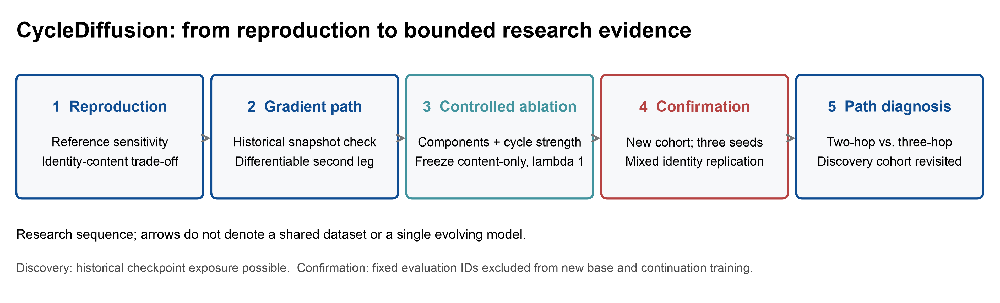
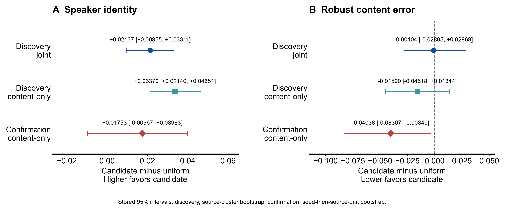
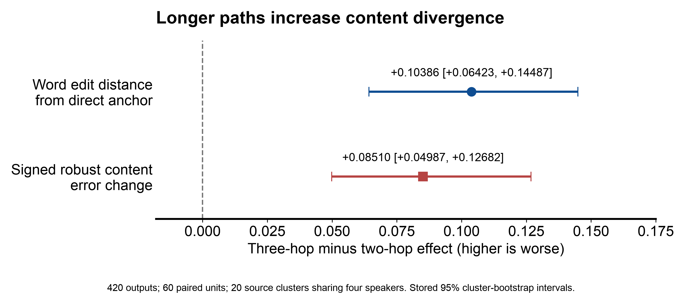

# Reproducing and Extending CycleDiffusion

### Reliability and Conversion-Path Analysis

**Jinpeng Zheng** · [GitHub profile](https://github.com/zhjp6969-dot)

An independent research note shared for discussion of cycle supervision,
implementation details, and future voice-conversion research.



*Conceptual overview of the implemented cycle branch and study design, not the
full model architecture. Independent confirmation yielded mixed results;
path-length analysis is evaluation only. [View full-size figure](figures/research_overview.png).*

This repository documents a reproducibility audit and a sequence of controlled
extensions to CycleDiffusion voice conversion. The project began by reproducing
the authors' previously public implementation, then moved from implementation
verification to controlled ablation, independent replication, and conversion
path-length diagnosis.

The final result is deliberately not presented as a new universally superior
method. A reliability-aware candidate produced positive evidence in the
four-speaker discovery cohort, but its speaker-identity advantage did not satisfy
the frozen confirmation criterion on a non-overlapping cohort across three
seeds. The repository therefore preserves a mixed replication.

## Research questions

1. How does gradient propagation behave along the reconstructed cycle path in
   the historical implementation available for this study?
2. Can reliability-aware cycle weighting improve speaker identity without
   increasing linguistic-content error?
3. How does measured content divergence change with conversion-path length?



## Main findings

Component ablation identified `content_only` as the strongest discovery-cohort
identity candidate. A subsequent weighting-by-cycle-strength interaction test did
not support lambda 0.25 for that candidate, so `content_only, lambda=1` was frozen
for independent confirmation against `uniform, lambda=1`.

| Question | Result | Boundary |
|---|---|---|
| Gradient path | The archived second conversion also passes through `torch.no_grad()` inference methods, detaching cycle L1 from decoder parameters. A differentiable second reverse-conversion path restored a finite, non-zero decoder gradient. | Applies to the preserved historical snapshot; it is not a claim about every author-side implementation. |
| Discovery-cohort weighting | On the fixed four-speaker grid, `joint - uniform` improved WavLM identity delta by `+0.02137` (cluster-bootstrap 95% CI `[+0.00955,+0.03311]`) with no detected robust-content penalty. | Twenty source clusters share four speakers; the checkpoint may have historical sentence exposure. |
| Independent confirmation | On speakers `p225`, `p226`, `p228`, and `p232` across seeds 17, 37, and 73, `content_only - uniform` identity was `+0.01753`, but the hierarchical 95% interval crossed zero (`[-0.00967,+0.03983]`). Robust content error improved by `-0.04038`. | The preregistered identity promotion rule was not met; the result is a mixed replication. |
| Path length | Three-hop minus two-hop increased word edit distance by `+0.10386` and robust content error by `+0.08510`; both 95% intervals excluded zero in the harmful direction. | Discovery-cohort diagnostic only; no independent-speaker confirmation or human listening test. |



Discovery intervals resample 20 source clusters sharing four speakers;
confirmation intervals resample seeds then source units (60 units, three seeds,
four different speakers). The cohorts and base-training histories differ.
Robust content error is the maximum of WER and CER individually capped at one;
its confirmation benefit does not establish a WER/CER or perceptual benefit.



Word edit distance compares ASR output with the direct-conversion anchor.
The signed content-error contrast uses the bounded transcript-error proxy.
See [figure sources and definitions](figures/README.md).

## What is included

- an independently written static gradient-path auditor;
- a memory-safe differentiable second reverse-diffusion training path;
- reliability-component, cycle-strength, and interaction ablations;
- a clean, non-overlapping four-speaker confirmation cohort with three seeds;
- direct, two-hop, and three-hop conversion diagnostics;
- sanitized numeric score tables, aggregate statistics, manifests, and figures;
- English research and reproducibility documentation.

## Start here

- [`reports/contact_summary_en.md`](reports/contact_summary_en.md): concise
  research brief and interpretation of the complete evidence chain.
- [`reports/reproducibility_audit.md`](reports/reproducibility_audit.md):
  implementation, data-boundary, and reproducibility audit.
- [`research/CONTROLLED_EXPERIMENT.md`](research/CONTROLLED_EXPERIMENT.md):
  controlled comparison and definition-of-done record.
- [`docs/provenance.md`](docs/provenance.md): historical source provenance and
  the public/private release boundary.

## Check the reported results

The headline summary check needs only Python 3 and the included safe tables:

```bash
python scripts/verify_research_summary.py
```

It checks summary consistency, counts, confirmation and path-length unit means, and the
reported decision. It does not rerun audio evaluation or recompute bootstrap
intervals. Full analysis scripts and private-asset requirements are documented
in each experiment directory.

Regenerate the figures with Matplotlib:

```bash
python -m pip install -r requirements-figures.txt
python scripts/make_research_figures.py
```

The earlier 900-output conditioning analysis uses the standard library:

```bash
python scripts/analyze_completed_experiment.py
```

It validates the 900-output grid and regenerates the processed summaries and
two SVG figures. Later experiment directories contain their own analysis entry
points and preregistered protocol records.

```text
data/public/       sanitized row-level numeric scores
data/processed/    aggregate and paired analysis outputs
figures/           deterministic diagnostic figures
reports/           English research and reproducibility reports
research/          controlled protocols and training/evaluation extensions
scripts/           reusable audit and statistical-analysis tools
notebooks/         English-only public execution notebooks
docs/              provenance and release-boundary documentation
```

## Evidence boundaries

- No human-listener evaluation was completed; no perceptual-superiority claim
  is made.
- The package reproduces the early conditioning analysis from safe row-level
  scores and regenerates overview figures from later summary tables. Full later
  reanalysis requires private raw records; audio regeneration also requires assets.
- Checkpoints, VCTK-derived audio and transcripts, generated waveforms, raw ASR
  hypotheses, and private runtime paths are excluded.
- The historical upstream source snapshot and original Colab log remain in the
  private research archive because no upstream redistribution license could be
  verified.
- The interpolation experiment is an inference-time diagnostic, not a claimed
  replacement for CycleDiffusion training.
- CycleDiffusion operates on Mel-spectrogram features; this project does not
  describe its cycle objective as waveform-level training.

## Licensing status

This publicly accessible research repository currently carries no redistribution license.
Original analysis software, documentation, and results will be assigned explicit
licenses only after the remaining upstream-derived boundaries are reviewed.
Absence of a license does not grant permission to reproduce or redistribute the
repository contents.

## Discussion

Feedback on the intended cycle-gradient path and on independent replication of
conversion-leg errors would be particularly useful. This repository is maintained
by Jinpeng Zheng and is independent of the original authors' repository.

## Reference

D. Yook, G. Han, H.-P. Chang, and I.-C. Yoo, “CycleDiffusion: Voice Conversion
Using Cycle-Consistent Diffusion Models,” *Applied Sciences*, 14(20), 9595,
2024. <https://doi.org/10.3390/app14209595>
