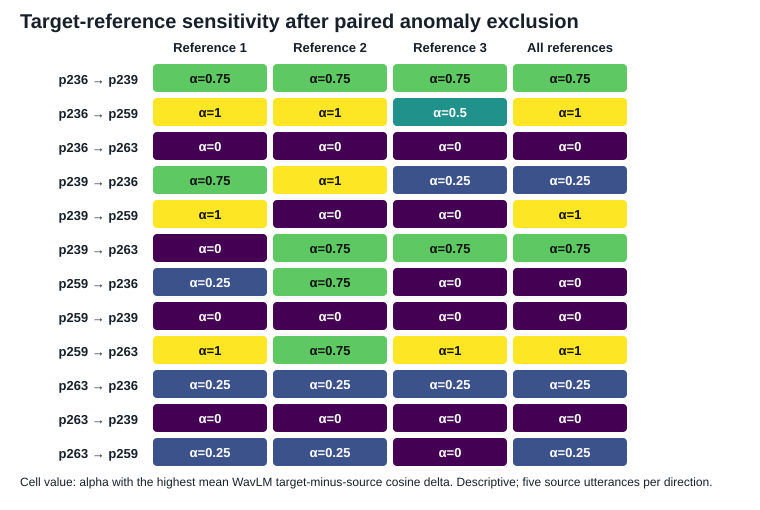
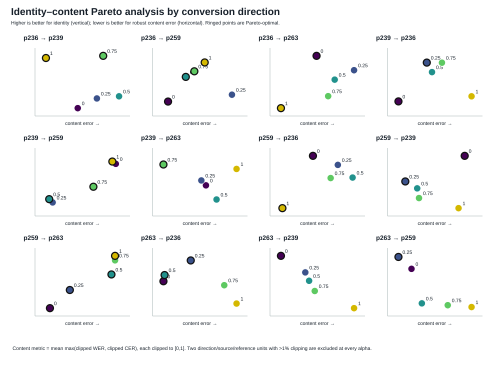

# Auditing and Extending CycleDiffusion for Voice Conversion

This repository presents a gradient-path audit, controlled training extensions,
independent replication, and path-length diagnosis built around the
four-speaker CycleDiffusion voice-conversion setup. The initial diagnostic asks
whether interpolating a
target-reference condition toward a target-speaker centroid condition with a
scalar `alpha` changes target-speaker identity matching, and whether any identity
gain is accompanied by content or acoustic degradation.

The interpolation remains an inference-time sensitivity analysis. Separately,
the discovery-cohort continuation experiment provides positive, but tightly
bounded, evidence for reliability-aware weighting. A clean, independent-cohort,
three-seed confirmation is also complete: it did not satisfy the frozen identity
promotion rule, despite improving the robust content-error proxy. The repository
therefore records a mixed replication rather than promoting a final method.

## Start here

- [`reports/contact_summary_en.md`](reports/contact_summary_en.md): concise
  research brief for the full evidence chain.
- [`reports/reproducibility_audit.md`](reports/reproducibility_audit.md):
  implementation, data-boundary, and reproducibility audit.
- [`docs/provenance.md`](docs/provenance.md): origin of the historical code
  snapshot and the public/private release boundary.

## Layered continuation status

The completed formal record is the fixed four-speaker `uniform` versus `joint`
comparison. Its concise question, boundaries, execution order, result, and
definition of done are in
[`research/CONTROLLED_EXPERIMENT.md`](research/CONTROLLED_EXPERIMENT.md).

| Layer | Status | Deliverable |
|---|---|---|
| 1 | Complete | Claim and evidence boundary correction |
| 2 | Complete | Reference sensitivity and identity-content Pareto analysis |
| 3 | Primary full-epoch comparison complete | Reliability-weighted differentiable cycle-training overlay and matched `uniform` control |
| 4 | Full component ablation complete | Five matched weighting strategies plus the epoch-50 base on a 1,080-output combined grid |
| 5 | Full lambda ablation complete | 900-output cycle-strength sweep at lambda 1, 0.5, 0.25, and 0 |
| 6 | Formal 540-output evaluation complete | Non-circular identity, content, and acoustic evaluation with paired cluster summaries |
| 7 | Asset gate ready; data-blocked | Extension from four to eight speakers requires four additional preprocessed speakers |
| 8 | Full 480-output Trinity grid complete | Five-sentence compositional diagnostic separates path divergence from seed and reference baselines |
| 8b | Complete | Frozen one/two/three-hop diagnostic; 60 paired units and 420 evaluated outputs, with both co-primary three-minus-two intervals harmful |
| 9 | Full 2 x 2 interaction complete | 720-output weighting x cycle-strength test; content-only does not benefit from weaker cycle supervision |
| 10 | Independent confirmation complete; mixed result | New four-speaker cohort, three clean seeds, matched `content_only` vs `uniform` at lambda 1, and 1,080 evaluated outputs |

The training audit found that the archived second conversion is also routed
through `torch.no_grad()`, so its reported cycle loss cannot update the decoder.
The Layer 3 overlay restores gradients only for the second reverse-diffusion
path, keeps the first pseudo-conversion frozen, and includes a positive gradient
probe before a run is accepted. On a Colab T4 with PyTorch `2.11.0+cu128`, both
the one-step sampler check and the preregistered six-step check passed. In the
six-step check, cycle L1 was `1.30681` and the named decoder cycle-gradient
probe was finite and positive (`5979.17`). This validates the implementation;
it is not evidence that the new training method improves conversion quality.

A clean-reference 20-step `uniform` versus `joint` pilot also completed. The
fixed Layer 6 descriptive check used 12 directions, source sentence `002`, target
reference `003`, and WavLM centroids from eight other continuation-excluded
sentences. Both pilots reduced Whisper error relative to the epoch-50 base on
this tiny grid. `uniform` had the higher mean identity delta; `joint` had the
slightly lower content error. Direct `joint - uniform` intervals crossed zero
for both metrics. These are stability and pipeline checks, not model-selection
evidence.

The preregistered full comparison has now completed: each continuation contains
461 matched optimizer steps, followed by a 540-output grid covering 12
directions, five source sentences, and three target references for each of the
three variants (`base_epoch50`, `uniform_e51`, and `joint_e51`). Relative to
`uniform`, `joint` increased mean WavLM identity delta by `+0.02137` across 20
paired source clusters (bootstrap 95% CI `[+0.00955, +0.03311]`; positive in
15/20 clusters). The robust content-error difference was `-0.00104` with a 95%
CI of `[-0.02805, +0.02868]`, so no additional content penalty was detected.
This closes the primary question positively on the fixed four-speaker grid.
It does not establish population-level generalization: the 20 clusters share
only four speakers, and the starting epoch-50 checkpoint may have historical
exposure to the evaluation sentences.

Layer 4 then completed the matched `speaker_only`, `content_only`, and
`hard_gate` continuations and combined them with the existing `uniform` and
`joint` records. The final ablation contains 1,080 evaluated outputs. Mean
identity delta was `0.29734` for `uniform`, `0.30071` for `speaker_only`,
`0.33104` for `content_only`, `0.31871` for `joint`, and `0.31686` for
`hard_gate`. Relative to `uniform`, identity increased significantly for
`content_only` (`+0.03370`, 95% CI `[+0.02140, +0.04651]`), `joint`
(`+0.02137`, `[+0.00964, +0.03308]`), and `hard_gate` (`+0.01952`,
`[+0.00788, +0.03193]`), but not for `speaker_only` (`+0.00337`,
`[-0.00675, +0.01305]`). Every robust-content comparison against `uniform`
had an interval crossing zero. The component evidence therefore points to the
content-reliability term, rather than the speaker-reference score alone, as the
main contributor to the observed identity improvement.

Layer 5 completed the prespecified cycle-strength test. Lambda 0.25 produced the
highest mean identity delta (`0.33562`), compared with `0.31871` at lambda 1.
The paired source-cluster difference was `+0.01690` with a 95% bootstrap CI of
`[+0.00904,+0.02554]`. Robust content error was nearly unchanged (`+0.00300`,
95% CI `[-0.02250,+0.03050]`), although mean WER/CER were higher and more
variable at lambda 0.25. Lambda 0.5 and lambda 1 had no detected identity or
content difference. Removing cycle supervision (lambda 0) substantially harmed
content preservation; this supports the necessity of cycle training but not a
monotonic “more cycle is always better” claim.

Layer 8 asks whether direct and two-leg conversions to the same final speaker
are compositionally consistent. Its fixed Trinity protocol includes stochastic
and reference baselines, so ordinary diffusion noise or reference sensitivity
is not mislabeled as a path failure. The complete base-checkpoint grid covers
all 24 ordered speaker triples, five source sentences, 120 paired units, and 480
evaluated outputs. Relative to alternate-reference direct conversion, the
composed path was farther away on all five metrics and in all 20 source
clusters. Relative to stochastic direct conversion, however, the result was
metric-dependent: composed outputs were closer in WavLM space (`-0.01832`, 95%
CI `[-0.02810,-0.00728]`) but farther in word-edit space (`+0.05911`,
`[+0.02893,+0.09277]`) and robust-content space (`+0.07671`,
`[+0.03234,+0.11821]`). The full grid therefore confirms divergence beyond
ordinary reference variation and a content-path effect beyond reseeding, but it
does not support a metric-independent generic path-failure claim. Protocol,
scripts, results, and integrity-checked Kaggle evidence are in
[`research/layer8_compositional/`](research/layer8_compositional/) and
[`data/processed/layer8_trinity_full/`](data/processed/layer8_trinity_full/).

Layer 9 completed the planned `uniform/content_only x lambda=1/0.25`
interaction experiment. Each cell has 180 paired outputs; the three new cells
each completed 461 optimizer steps, while `uniform, lambda=1` was reused from
the formal evaluation. The primary identity difference-in-differences was
`-0.02369` (20-source-cluster bootstrap 95% CI
`[-0.03716,-0.01111]`, paired sign-flip `p=0.00202`). Robust content error had
no detected interaction (`-0.01068`, CI `[-0.03979,+0.02002]`). At
`lambda=0.25`, content-only also produced substantially more silence than
uniform (`+0.05683`) and lower level (`-2.696 dBFS`); the corresponding
interaction effects were `+0.09605` silence fraction and `-4.506 dBFS`.
Therefore weaker cycle supervision does not unlock a content-reliability
advantage in this setting. The current evidence favors freezing the conservative
`uniform, lambda=1` baseline for clean/new-speaker multi-seed confirmation,
rather than promoting `content_only, lambda=0.25` as the final method. Public
scripts and aggregate summaries are in
[`research/layer9_interaction/`](research/layer9_interaction/) and
[`data/processed/layer9_interaction/`](data/processed/layer9_interaction/).
Raw evaluator rows, run paths, logs, and the integrity-checked archive remain
local and Git-ignored.

Layer 10 completed the frozen independent-cohort confirmation. It compared
`content_only, lambda=1` with the seed-matched `uniform, lambda=1` control across
clean seeds 17, 37, and 73 on the non-overlapping VCTK cohort `p225`, `p226`,
`p228`, and `p232`. All fixed evaluation sentences were excluded from base and
continuation training. The final grid contains 1,080 evaluated outputs and is
collapsed to 60 seed/source-speaker/source-sentence units.

The pooled `content_only - uniform` identity difference was `+0.01753`, but its
seed-then-source-unit hierarchical 95% interval crossed zero
(`[-0.00967,+0.03983]`). Seeds 17 and 37 were positive (`+0.03474` and
`+0.02902`), while seed 73 was negative (`-0.01116`). Robust content error
improved by `-0.04038` with interval `[-0.08307,-0.00340]`; clipping was
effectively unchanged, average silence decreased, and loudness intervals crossed
zero. Because the frozen identity rule required the pooled interval to exclude
zero, `automatic_promotion=false`: this is a mixed replication and the candidate
is not promoted.

Kaggle Version 3, `Layer 10 confirmation complete`, preserves the completed
notebook. The verified essential result bundle and extracted tables are in
[`data/processed/layer10_confirmation/`](data/processed/layer10_confirmation/),
and the protocol and executable analysis are in
[`research/layer10_confirmation/`](research/layer10_confirmation/). The Kaggle
GPU session was stopped after local persistence.

Layer 8b completed the frozen path-length diagnostic without adding another
weighting rule. It compares direct, two-hop, and three-hop conversions to the
same target while holding the final reference and final-leg seed fixed and
retaining both intermediate-speaker orders. All 420 planned outputs were
generated and evaluated across 60 paired units. Relative to two-hop paths,
three-hop paths increased word edit distance by `+0.10386` (20-source-cluster
bootstrap 95% CI `[+0.06423,+0.14487]`) and signed robust content error by
`+0.08510` (`[+0.04987,+0.12682]`). Both co-primary intervals exclude zero in
the harmful direction, so the frozen primary hypothesis is supported on this
discovery cohort. Three-hop paths were also farther in WavLM space, more silent,
and quieter. This is a path-length degradation diagnostic, not a promoted model:
the 20 clusters share four speakers, the checkpoint may have historical sentence
exposure, and no perceptual evaluation was performed. Protocol and code are in
[`research/layer8_path_length/`](research/layer8_path_length/); verified results
are in [`data/processed/layer8_path_length/`](data/processed/layer8_path_length/).

## Evidence status

- 4 VCTK speakers: `p236`, `p239`, `p259`, and `p263`
- 12 directed conversion directions
- 5 source utterances per speaker and 3 target references per direction
- 5 alpha settings: `0`, `0.25`, `0.5`, `0.75`, and `1`
- 900 converted outputs, but only 20 independent source-utterance clusters
- WavLM speaker identity, Whisper content errors, and waveform sanity checks
- no completed human-listener evaluation

The three row-level score tables have identical experiment keys and contain no
duplicate converted rows. Two direction/source/reference units exceeded 1%
clipping. All five alpha outputs from each affected unit are excluded together in
the primary sensitivity analysis, preserving paired comparisons.

## Main findings

### Independent-cohort confirmation

1. `content_only - uniform` improved mean identity delta by `+0.01753`, but the
   hierarchical 95% interval `[-0.00967,+0.03983]` crossed zero.
2. The identity effect was positive in two of three seeds and negative in the
   third, so seed-level heterogeneity matters.
3. Robust content error improved by `-0.04038`, 95% interval
   `[-0.08307,-0.00340]`; WER and CER intervals remained wide and crossed zero.
4. No systematic clipping, silence, or loudness regression was detected.
5. The frozen promotion rule was not met. The defensible conclusion is a mixed
   replication, not a confirmed general identity advantage.

Exact pooled, per-seed, per-speaker, and source-unit results are in
[`data/processed/layer10_confirmation/analysis/`](data/processed/layer10_confirmation/analysis/).

### Reliability-aware continuation

1. `joint` outperformed matched `uniform` continuation on WavLM identity delta:
   `+0.02137`, cluster-bootstrap 95% CI `[+0.00955, +0.03311]`.
2. Robust content error was effectively unchanged between `joint` and
   `uniform`: `-0.00104`, 95% CI `[-0.02805, +0.02868]`.
3. Against the epoch-50 base, `joint` improved identity by `+0.01979` and
   reduced robust content error by `-0.20345`; `uniform` reduced content error
   similarly but did not improve identity (`-0.00158`).
4. The reliability computation is currently expensive: the recorded full epoch
   took about `4058 s` for `joint` versus `534 s` for `uniform`. Efficiency
   optimization is therefore a real limitation, not yet a scalability result.

The exact aggregate and paired tables are in
[`data/processed/layer6_formal_eval_variant_summary.csv`](data/processed/layer6_formal_eval_variant_summary.csv),
[`data/processed/layer6_formal_eval_paired_comparisons.csv`](data/processed/layer6_formal_eval_paired_comparisons.csv),
and [`data/processed/layer6_formal_training_summary.csv`](data/processed/layer6_formal_training_summary.csv).
The completed component-ablation summaries are in
[`data/processed/layer4_full_variant_summary.csv`](data/processed/layer4_full_variant_summary.csv),
[`data/processed/layer4_full_primary_comparisons.csv`](data/processed/layer4_full_primary_comparisons.csv),
and [`data/processed/layer4_full_summary.json`](data/processed/layer4_full_summary.json).
The completed cycle-strength summaries are in
[`data/processed/layer5_lambda_ablation/layer5_variant_summary.csv`](data/processed/layer5_lambda_ablation/layer5_variant_summary.csv),
[`data/processed/layer5_lambda_ablation/layer5_paired_comparisons.csv`](data/processed/layer5_lambda_ablation/layer5_paired_comparisons.csv),
and [`data/processed/layer5_lambda_ablation/layer5_summary.json`](data/processed/layer5_lambda_ablation/layer5_summary.json).

### Conditioning interpolation diagnostic

1. `alpha=0` remains the best global fixed setting. There is no evidence for a
   universal non-zero alpha.
2. Leave-one-source-out, direction-specific identity calibration yields a small
   mean WavLM target-minus-source cosine gain of `+0.00660` across 20 source
   clusters (bootstrap 95% CI `[+0.00172, +0.01214]`) after paired anomaly
   exclusion.
3. The same calibration increases the bounded robust content-error proxy by
   `+0.00856` (bootstrap 95% CI `[+0.00135, +0.01575]`). The identity gain is not
   free.
4. The three target references select the same descriptive best alpha in only
   5 of 12 directions. Among the 8 directions whose aggregate optimum is
   non-zero, only 5 improve identity for every reference.
5. Most directions have multiple identity-content Pareto choices, so reporting a
   single "best" alpha without a content constraint is misleading.





## Reproduce the repository analysis

The audit and the two added analyses use only the Python standard library:

```bash
python scripts/analyze_completed_experiment.py
```

The command validates the experiment grid and regenerates:

- `data/processed/audit_summary.json`
- `data/processed/reference_sensitivity.csv`
- `data/processed/reference_best_alpha.csv`
- `data/processed/identity_content_pareto.csv`
- both SVG figures

`data/public/` contains only experiment keys and numeric scores. Paths, VCTK
reference text, Whisper hypotheses, audio, and model files are intentionally not
included in the public-data layer.

## Repository map

```text
data/public/       sanitized row-level numeric scores
data/processed/    regenerated audit and analysis outputs
figures/           publication-ready diagnostic figures
reports/           English research brief and reproducibility documentation
scripts/           reproducible audit, evaluation, and statistical analysis
notebooks/         English-only public execution notebooks
research/          controlled protocols and differentiable training extensions
docs/              provenance and release-boundary documentation
```

Publication boundaries and the automated release checks are recorded in
[`reports/github_release_audit.md`](reports/github_release_audit.md).

## Reproducibility boundaries

The repository fully reproduces the **analysis from stored scores**. A private,
integrity-recorded Colab log and historical generation snapshot additionally
recover the alpha formula, file slices, checkpoint paths, 30-step inference,
and per-item seed rule. They are not redistributed because the historical
upstream snapshot has no verified redistribution license. See
[`reports/reproducibility_audit.md`](reports/reproducibility_audit.md) and
[`docs/provenance.md`](docs/provenance.md).

The audit also corrects an important boundary: the main conditioning centroid
uses the first 20 sorted target utterances and therefore includes the first three
target references. Only the WavLM evaluation centroid (utterances 41--60) is
fully held out. A later clean-centroid screen used utterances 21--40, but it is a
four-direction follow-up rather than the source of the 900-row main result.

Full audio regeneration remains unavailable from the public package because
weights, VCTK audio, generated audio, the historical upstream source snapshot,
and a fully pinned environment are intentionally absent. Integrity hashes and
the audit description preserve the evidentiary boundary without presenting the
repository as a one-command re-release of upstream assets.

## Interpretation boundary

CycleDiffusion trains on Mel-spectrogram features; it should not be described as a
waveform-level cycle objective. The paper's central contribution is explicit
conversion-path training through cycle consistency. This study does not test a
replacement training objective and does not establish perceptual superiority.

## Reference

D. Yook, G. Han, H.-P. Chang, and I.-C. Yoo, “CycleDiffusion: Voice Conversion
Using Cycle-Consistent Diffusion Models,” *Applied Sciences*, 14(20), 9595, 2024.
https://doi.org/10.3390/app14209595
